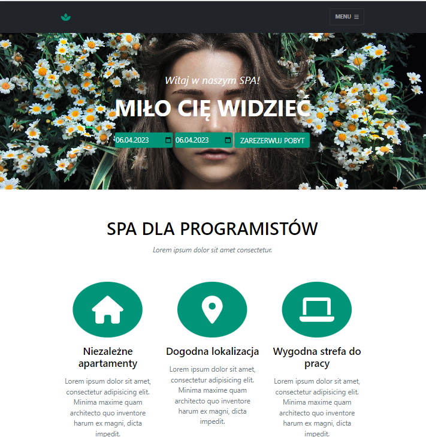

# IT SPA

## Table of Contents
* [General Info](#general-information)
* [Technologies Used](#technologies-used)
* [Features](#features)
* [Screenshots](#screenshots)
* [Usage](#usage)
* [Project Status](#project-status)

## General Information
Project of a Single Page Application for a dedicated SPA center
programmers.

## Technologies Used
- HTML, Bootstrap
- CSS, SCSS
- JavaScript
- Node, Express

## Features
List the ready features here:
- Browse available treatments
- Adding selected treatments to the cart
- Selection of arrival and departure date and room
- User login
- User registration
- Summary of your order

## Screenshots

<!-- If you have screenshots you'd like to share, include them here. -->

## Usage

`npm start:app`

## Project Status
Project is: _in progress_ / _complete_ / _no longer being worked on_. If you are no longer working on it, provide reasons why.

